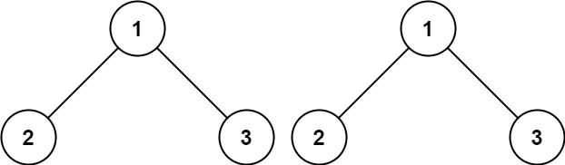

# [100. Same Tree](https://leetcode.com/problems/same-tree/) `Easy`

Given the roots of two binary trees `p` and `q`, write a function to check if they are the same or not.

Two binary trees are considered the same if they are structurally identical, and the nodes have the same value.

**Example 1:**



```
Input: p = [1,2,3], q = [1,2,3]

Output: true
```

**Example 2:**


```
Input: p = [1,2], q = [1,null,2]

Output: false
```

**Example 3:**


```
Input: p = [1,2,1], q = [1,1,2]

Output: false
```

**Constraints:**

- The number of nodes in both trees is in the range `[0, 100]`.
- `-104 <= Node.val <= 104`

**Topics:**

- Tree
- Depth-First Search
- Breadth-First Search
- Binary Tree
