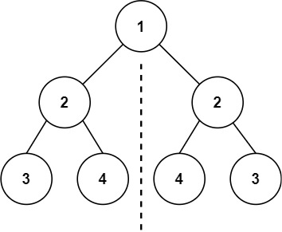
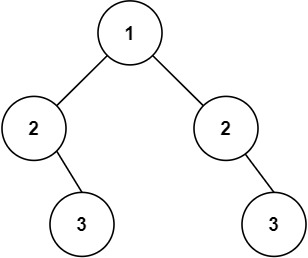

# [101. Symmetric Tree](https://leetcode.com/problems/symmetric-tree/) `Easy`

Given the `root` of a binary tree, *check whether it is a mirror of itself* (i.e., symmetric around its center).

**Example 1:**



```
Input: root = [1,2,2,3,4,4,3]

Output: true
```

**Example 2:**



```
Input: root = [1,2,2,null,3,null,3]

Output: false
```

**Constraints:**

- The number of nodes in the tree is in the range `[1, 1000]`.
- `-100 <= Node.val <= 100`

**Topics:**

- Tree
- Depth-First Search
- Breadth-First Search
- Binary Tree

**Follow up:** Could you solve it both recursively and iteratively?
